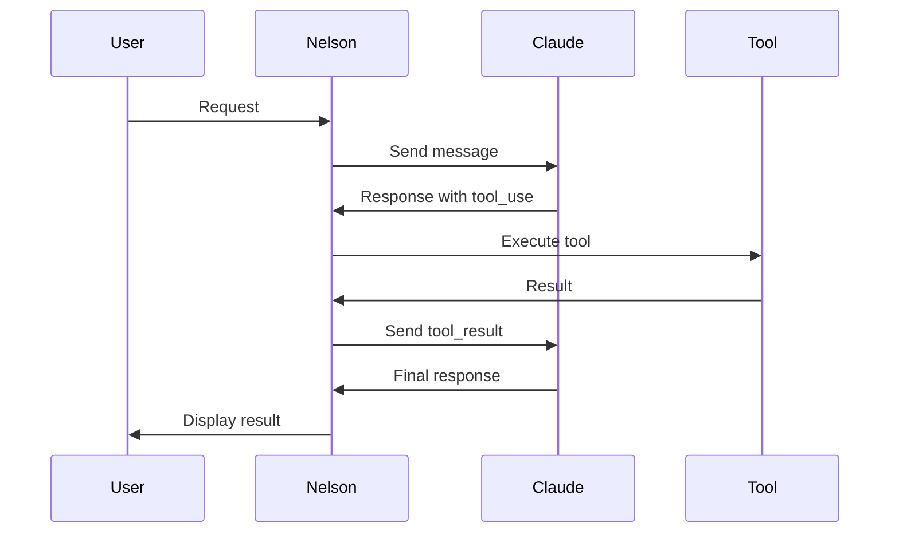

## Architecture

Nelson CLI is built with a modular architecture:

```
nelson-muntz-cli/
├── bin/nelson          # CLI entry point
├── src/
│   ├── index.js        # Main application
│   ├── api/
│   │   ├── anthropic.js    # Claude API integration
│   │   └── system-prompt.js # Nelson personality
│   ├── ui/
│   │   ├── logo.js         # ASCII art & animations
│   │   └── terminal.js     # UI components
│   ├── tools/
│   │   └── index.js        # Tool implementations
│   └── loop/
│       └── nelson-loop.js  # Loop management
```

## Core Components

### NelsonAI Class

The main interface to Claude's API.

```javascript
class NelsonAI {
  constructor(apiKey)
  getModelName()
  clearHistory()
  async chat(userMessage)
}
```

### TerminalUI Class

Handles all terminal output and input.

```javascript
class TerminalUI {
  box(content, options)
  userMessage(text)
  assistantMessage(text)
  haha(message)
  error(text)
  warning(text)
  info(text)
  startSpinner(text)
  stopSpinner()
  getInput(prompt)
  clear()
}
```

### NelsonLoop Class

Manages iterative development loops.

```javascript
class NelsonLoop {
  async isActive()
  async getState()
  async start(prompt, options)
  async cancel()
  async checkCompletion(response)
}
```

## API Communication

Nelson uses the Anthropic SDK to communicate with Claude:

```javascript
import Anthropic from '@anthropic-ai/sdk';

const client = new Anthropic({ apiKey });

const response = await client.messages.create({
  model: 'claude-sonnet-4-20250514',
  max_tokens: 8192,
  system: NELSON_SYSTEM_PROMPT,
  tools: tools,
  messages: messages,
});
```

## Message Format

Messages are stored in the conversation history:

```javascript
// User message
{
  role: 'user',
  content: 'Help me write a function'
}

// Assistant message
{
  role: 'assistant',
  content: [
    { type: 'text', text: 'Here is the function...' },
    { type: 'tool_use', id: '...', name: 'write_file', input: {...} }
  ]
}

// Tool result
{
  role: 'user',
  content: [
    { type: 'tool_result', tool_use_id: '...', content: 'File written successfully' }
  ]
}
```

## Tool Use Flow

When Nelson uses a tool:



## Environment Variables

| Variable | Required | Description |
|----------|----------|-------------|
| `ANTHROPIC_API_KEY` | Yes | Your Anthropic API key |

## Dependencies

| Package | Purpose |
|---------|---------|
| `@anthropic-ai/sdk` | Claude API client |
| `chalk` | Terminal colors |
| `boxen` | Box drawing |
| `ora` | Spinners |
| `gradient-string` | Gradient text |
| `terminal-kit` | Advanced terminal features |
