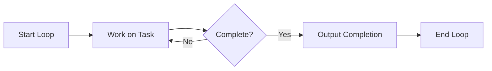

## What is Nelson Loop?

Nelson Loop is a powerful feature that enables **iterative AI development**. Instead of a single back-and-forth, Nelson Loop continuously works on your task until it's complete.

<Info>
  Think of it as setting a goal and letting Nelson iterate until success - like a tireless developer who doesn't stop until the tests pass.
</Info>

## How It Works



1. You start a loop with a prompt and completion criteria
2. Nelson works on the task
3. Nelson checks if the task is complete
4. If not complete, Nelson sees previous work and continues
5. When complete, Nelson outputs the completion signal
6. Loop ends

## Starting a Nelson Loop

```bash
/nelson-loop "Your task description" --max-iterations 20 --completion-haha "DONE"
```

### Parameters

<ParamField path="prompt" type="string" required>
  The task description. Be specific about what you want accomplished.
</ParamField>

<ParamField path="--max-iterations" type="number" default="unlimited">
  Safety limit on iterations. **Always recommended** to prevent infinite loops.
</ParamField>

<ParamField path="--completion-haha" type="string">
  The exact phrase Nelson should output when the task is genuinely complete.
</ParamField>

## Completion Signal

To complete a loop, Nelson must output a special tag:

```xml
<haha>YOUR_COMPLETION_PHRASE</haha>
```

For example, if you set `--completion-haha "TESTS PASSING"`:

```xml
<haha>TESTS PASSING</haha>
```

<Warning>
  Nelson is trained to only output the completion signal when the statement is **genuinely true**. He won't lie to escape the loop.
</Warning>

## Examples

### Build a REST API

```bash
/nelson-loop "Build a REST API for a todo app with:
- CRUD endpoints (GET, POST, PUT, DELETE)
- Input validation
- Error handling
- Unit tests

Output <haha>API COMPLETE</haha> when all tests pass." --completion-haha "API COMPLETE" --max-iterations 30
```

### Fix Failing Tests

```bash
/nelson-loop "The test suite is failing. Investigate the failures, fix the code, and ensure all tests pass. Output <haha>TESTS FIXED</haha> when done." --completion-haha "TESTS FIXED" --max-iterations 15
```

### Implement a Feature

```bash
/nelson-loop "Implement user authentication with JWT:
1. Login endpoint
2. Token generation
3. Token validation middleware
4. Protected route example
5. Tests for all components

Output <haha>AUTH DONE</haha> when complete." --completion-haha "AUTH DONE" --max-iterations 25
```

## Monitoring Progress

While a loop is running, you'll see:

```
Ha-ha! Nelson iteration 5 | To stop: output <haha>DONE</haha>
```

Check status anytime with:

```bash
/status
```

## Canceling a Loop

To stop a loop early:

```bash
/cancel-nelson
```

<ResponseField name="Output">
  HA-HA! Cancelled Nelson loop (was at iteration N)
</ResponseField>

## Best Practices

<CardGroup cols={2}>
  <Card title="Always Set Max Iterations" icon="shield">
    Use `--max-iterations` as a safety net. Start with 10-20 for most tasks.
  </Card>
  <Card title="Clear Completion Criteria" icon="bullseye">
    Define exactly what "done" means. Vague goals lead to infinite loops.
  </Card>
  <Card title="Include Verification Steps" icon="check">
    Ask Nelson to run tests or verify the work before declaring completion.
  </Card>
  <Card title="Start Small" icon="seedling">
    Test with small tasks first to understand how loops behave.
  </Card>
</CardGroup>

## Writing Good Loop Prompts

### ❌ Bad Prompt

```
Build a good API
```

Too vague. No clear completion criteria.

### ✅ Good Prompt

```
Build a REST API for todos with:
- GET /todos - list all todos
- POST /todos - create a todo
- PUT /todos/:id - update a todo
- DELETE /todos/:id - delete a todo
- Input validation on all endpoints
- Tests for each endpoint

Run tests after implementation.
Output <haha>COMPLETE</haha> when all tests pass.
```

Specific requirements, clear structure, verification step, explicit completion criteria.

## Advanced: Multi-Phase Tasks

For complex projects, break them into phases:

```bash
/nelson-loop "Implement the user system:

PHASE 1: Database models
- User model with email, password hash, timestamps
- Migration file

PHASE 2: Authentication
- Register endpoint
- Login endpoint
- Password hashing

PHASE 3: Authorization
- JWT token generation
- Auth middleware
- Protected routes

PHASE 4: Testing
- Unit tests for each endpoint
- Integration tests

Complete each phase before moving to the next.
Output <haha>ALL PHASES COMPLETE</haha> when Phase 4 passes." --completion-haha "ALL PHASES COMPLETE" --max-iterations 50
```
